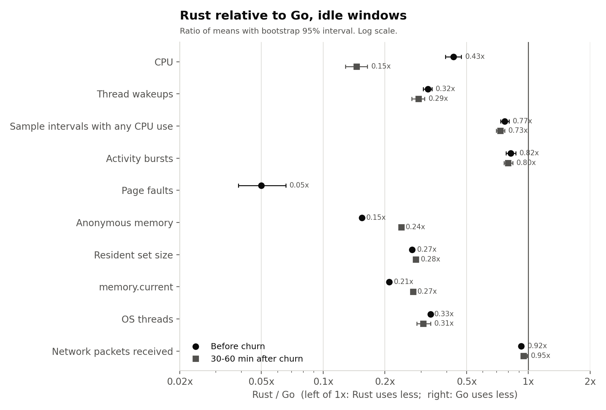
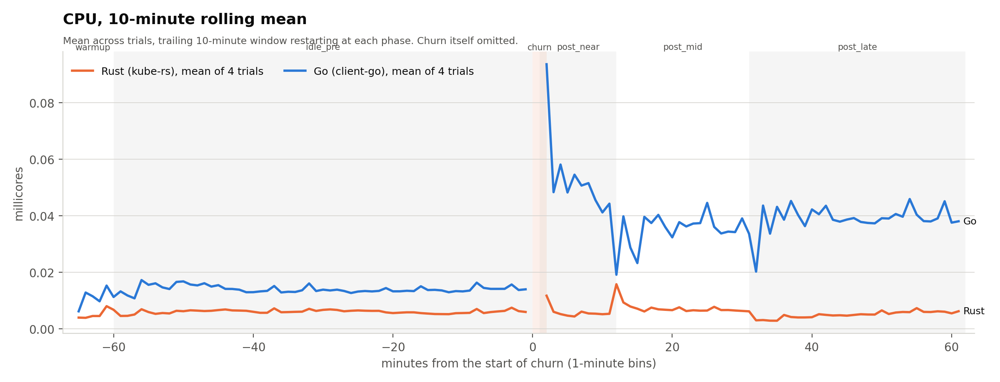
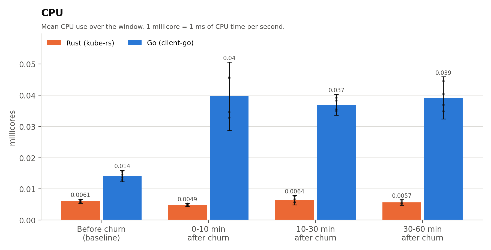
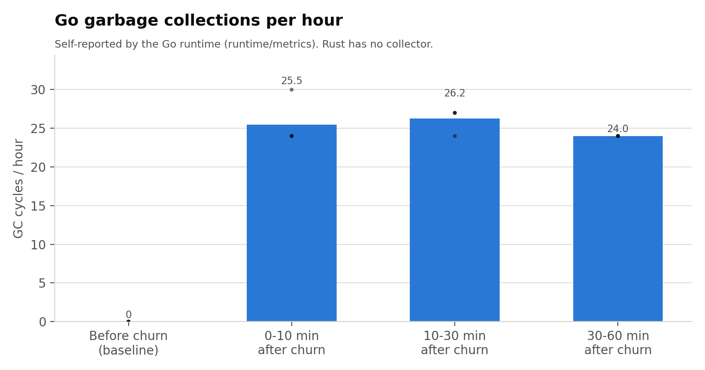
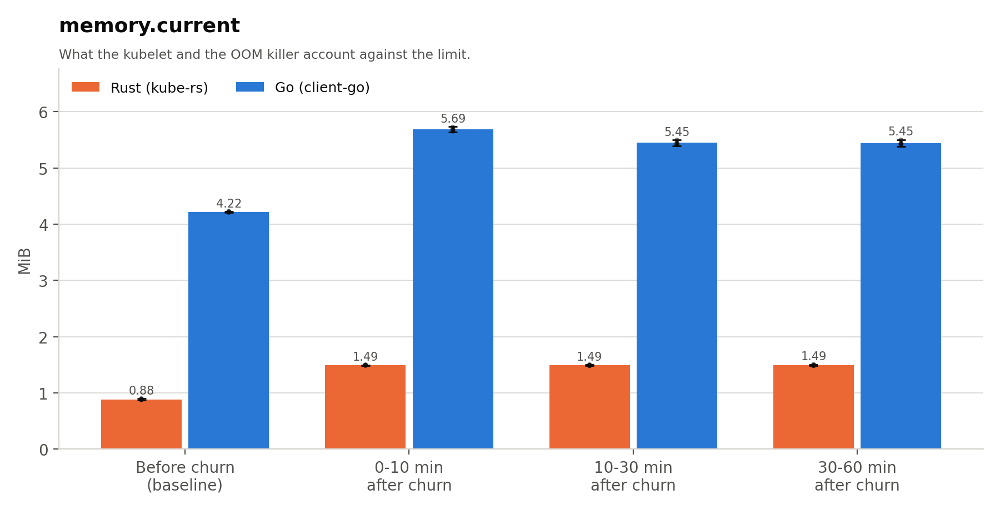
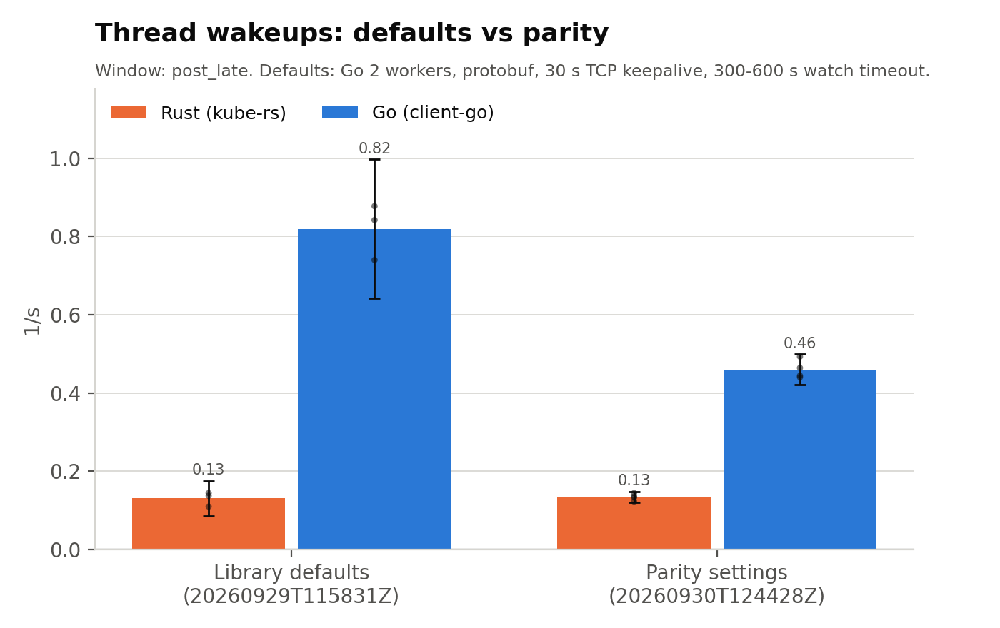

# rs-vs-go

How much does a Kubernetes watcher cost **while nothing is happening**? This repository runs two functionally identical ConfigMap watchers, one in Rust ([kube-rs](https://github.com/kube-rs/kube)) and one in Go ([client-go](https://github.com/kubernetes/client-go)), on a dedicated node for hours at a time. It measures CPU, thread wakeups, page faults and memory before and after a burst of work.

Both watchers keep a full in-memory cache through a real list-and-watch stream. Neither polls. Library and runtime defaults that differ between the two, and are not part of the language comparison, are set to the same value on both sides. The section [Making the comparison fair](#making-the-comparison-fair) lists every one.

## Results

Run `20260930T124428Z`: 4 trials per implementation, alternated Rust, Go, Go, Rust, and so on, about 2 h 10 min each. All 8 trials were valid. Every value is a mean across trials; the full tables have 95% intervals.

| Idle metric | Rust | Go | Rust / Go |
|---|---|---|---|
| CPU before any churn | 0.0061 millicores | 0.0142 millicores | 0.43x |
| CPU 30-60 min after churn | 0.0057 millicores | 0.0392 millicores | 0.15x |
| Thread wakeups before churn | 0.12 /s | 0.38 /s | 0.32x |
| Thread wakeups 30-60 min after churn | 0.13 /s | 0.46 /s | 0.29x |
| memory.current (cgroup) before churn | 0.88 MiB | 4.22 MiB | 0.21x |
| Resident set size | 6.3 MiB | 23.1 MiB | 0.27x |
| OS threads | 2 | 6 | 0.33x |
| CPU per ADD event during churn | 157 µs | 427 µs | 0.37x |
| Time from start to synced cache | 31 ms | 102 ms | 0.31x |

**Rust uses less of every resource, and the gap widens after the watcher has done some work.** Before churn, Go uses about 2.3x Rust's CPU. After creating and deleting 100 ConfigMaps, Go's idle CPU roughly triples and stays there for the full hour, while Rust's returns to its baseline.

<picture>
  <source media="(prefers-color-scheme: dark)" srcset="results/20260930T124428Z/report/dark/ratio_overview.png">
  
</picture>

The timeline shows the step. Go settles at a higher idle level after churn; Rust does not.

<picture>
  <source media="(prefers-color-scheme: dark)" srcset="results/20260930T124428Z/report/dark/timeline_millicores_rolling10.png">
  
</picture>

<picture>
  <source media="(prefers-color-scheme: dark)" srcset="results/20260930T124428Z/report/dark/window_millicores.png">
  
</picture>

### Why Go's idle cost rises after churn

Go's own runtime counters explain it. The Go runtime forces a garbage collection every 2 minutes, but only once at least one collection has happened. At startup the heap is too small to trigger the first one, so the baseline window shows zero collections. Processing 100 ConfigMaps triggers that first collection, and from then on the 2-minute forced collection runs indefinitely: about 25 per hour, with no further growth in memory. This is documented Go runtime behavior, not a leak. The Rust binary uses the system allocator and has no collector.

<picture>
  <source media="(prefers-color-scheme: dark)" srcset="results/20260930T124428Z/report/dark/go_gc_cycles_total_gc_cycles.png">
  
</picture>

### Memory

Go's footprint is larger from the start, mostly runtime and library heap. Both grow a little after churn and then stay flat.

<picture>
  <source media="(prefers-color-scheme: dark)" srcset="results/20260930T124428Z/report/dark/window_mem_mean_mib.png">
  
</picture>

### Library defaults versus parity settings

An earlier run, `20260929T115831Z`, used each library's defaults: Go with 2 worker threads, protobuf on the wire, a 30 s TCP keepalive and a random 300-600 s watch timeout. The parity run removed those differences.

| Metric, Go | Defaults | Parity |
|---|---|---|
| Thread wakeups 30-60 min after churn | 0.82 /s | 0.46 /s |
| Network packets received while idle | 5.4 /min | 3.7 /min |
| Bytes received per ADD event | 1442 B (protobuf) | 1659 B (JSON, same as Rust) |

The parity settings halved Go's post-churn wakeups and brought its network traffic level with Rust's. They did not change the conclusion: the Rust / Go CPU ratio 30-60 min after churn was 0.15x in both runs.

Absolute CPU numbers are not comparable between the two runs. The defaults run used the host's variable CPU clock; the parity run pinned it at 2.4 GHz. Both implementations show the same proportional drop between runs, which is the clock and not the code. Wakeups are a count, so they compare across runs.

<picture>
  <source media="(prefers-color-scheme: dark)" srcset="results/20260930T124428Z/report/dark/compare_post_late_wakeups_per_s.png">
  
</picture>

### What it means at scale

Per 1,000 idle watcher pods, projected from the per-pod means:

| Window | | CPU core-hours per month | memory.current | RSS |
|---|---|---|---|---|
| Before churn | Rust | 4.5 | 0.86 GiB | 6.1 GiB |
| Before churn | Go | 10.3 | 4.1 GiB | 22.6 GiB |
| 30-60 min after churn | Rust | 4.2 | 1.5 GiB | 6.7 GiB |
| 30-60 min after churn | Go | 28.6 | 5.3 GiB | 23.7 GiB |

The CPU differences are real and consistent but small in absolute terms: tens of core-hours per month per thousand pods. The memory difference, about 17 MiB of RSS per pod, is the larger practical cost.

### Caveats

- **Defaults compared.** Go runs with `GOGC=100` and no `GOMEMLIMIT`; Rust uses glibc malloc. Tuning either runtime is a separate experiment, never an adjustment to one side.
- **One node, one host.** The worker is a 2-vCPU KVM guest. Other VMs ran on the same host (load about 6 of 32 threads); alternating the order of trials spreads that noise over both implementations.
- **Context-switch counters cover the main thread only.** They read near zero for Go because its main thread parks while other threads do the work. Use thread wakeups for the whole process.
- **No hardware cycle counters.** Attaching `perf` in the VM inflated the watcher's own CPU about 50x through hypervisor traps on every context switch, penalizing whichever side wakes more often. The clock was pinned instead, so CPU time is proportional to cycles.

### All results

Everything for the parity run is under [`results/20260930T124428Z`](results/20260930T124428Z):

- [`summary.md`](results/20260930T124428Z/summary.md): every metric and window, with 95% intervals and Rust-minus-Go and Rust / Go bootstrap intervals.
- [`report/light`](results/20260930T124428Z/report/light) and [`report/dark`](results/20260930T124428Z/report/dark): 69 charts, one per rubric, PNG and SVG with transparent backgrounds.
- [`report/cmbench-20260930T124428Z.xlsx`](results/20260930T124428Z/report/cmbench-20260930T124428Z.xlsx): all tables with native Excel charts.
- CSVs: `summary_trials.csv` (every metric per trial), `summary_stats.csv`, `comparisons.csv`, `timeseries.csv` (1-minute bins aligned on churn), `threads.csv`, `rtm.csv` (runtime internals), `fairness.csv`, and `metrics.csv`, the dictionary that defines every metric.

The defaults run's tables are under [`results/20260929T115831Z`](results/20260929T115831Z). Raw per-trial samples are not committed: they are large and identify the test machines.

## Making the comparison fair

| | Rust `cmwatch-rs` | Go `cmwatch-go` |
|---|---|---|
| Client | kube 4.2 `reflector` + `watcher` | client-go v0.37.1 `SharedInformerFactory` |
| Cache | reflector `Store` | informer indexer |
| Toolchain | Rust 1.98, release, LTO, 1 codegen unit | Go 1.27, `CGO_ENABLED=0`, `-trimpath -s -w` |
| Runtime | tokio multi-thread, glibc malloc | Go runtime, default GC |
| Image | distroless `cc-debian12` | distroless `static-debian12` |

Settings held identical on both sides, and reported by each binary in its `START` line so every trial can be checked:

| Setting | Value | Why it needed setting |
|---|---|---|
| Worker threads | 1 (`GOMAXPROCS`, `TOKIO_WORKER_THREADS`) | Go's cgroup-aware default never drops below 2; tokio follows the 1-CPU quota |
| Wire format | JSON | client-go negotiates protobuf for built-in types; kube-rs only speaks JSON |
| HTTP | HTTP/1.1 | kube-rs has no HTTP/2; client-go's HTTP/2 adds a 30 s ping |
| TCP keepalive | off | client-go's dialer probes every 30 s; kube-rs sets none |
| Watch timeout | 290 s | client-go picks a random 300-600 s; kube-rs defaults to 290 s |
| Initial list | `resourceVersion=0`, pages of 500 | kube-rs defaults to a consistent read |
| Watch bookmarks | on | both defaults |
| Resync | none | informer resync period 0 |
| Pod | Guaranteed QoS, 1 CPU, 256 MiB, identical spec | only the image differs |

Left at defaults on purpose, because they are what is being compared: Go's garbage collector and glibc malloc.

## How a trial runs

```
startup    until the cache reports SYNCED
warmup     5 min, excluded
idle_pre   60 min   baseline, before any churn
create     100 ConfigMaps of 1 KiB, then 30 s settle
delete     delete all 100, then 30 s settle
post_near  0-10 min after churn
post_mid   10-30 min after churn
post_late  30-60 min after churn
```

Only one watcher exists at a time, in a fresh namespace per trial, on a cordoned node. A trial is valid only if the watcher saw exactly 100 creates and 100 deletes, with no watch errors, no restarts and the expected `START` line.

A node-local sampler reads the watcher's cgroup and `/proc/<pid>` every 100 ms using bash builtins only, so it adds no forks and its own cost lands in its own cgroup:

| Signal | Source |
|---|---|
| CPU time, user and kernel | cgroup `cpu.stat` |
| Thread wakeups | sum of `/proc/<pid>/task/*/schedstat` timeslices |
| Duty cycle and bursts | CPU delta per 100 ms tick |
| Page faults | cgroup `memory.stat` |
| Memory | `anon`, `memory.current`, `memory.peak`, RSS, high-water mark |
| Network | `/proc/<pid>/net/dev` in the pod's network namespace |
| Per-thread wakeups, with thread names | every 1 s |
| Noise | node load, CFS throttling, host CPU policy per trial |

At each phase change the sampler sends `SIGUSR1`, and each binary prints one line of runtime internals: Go's `runtime/metrics` (GC cycles, GC and scavenger CPU, heap) or glibc `mallinfo2` and tokio task counts. Nothing is printed between phase changes, so this adds no periodic work.

## Build and run

Requirements: a Kubernetes cluster with cgroup v2 and a dedicated worker node, `kubectl`, `envsubst`, and docker or podman to build. The setup used here was k0s v1.35.5 with containerd 1.7.32, and a 2-vCPU, 8 GiB worker VM.

```sh
# Build both images. Set BUILDER=podman and PLATFORM as needed.
make build

# Load them into the worker's containerd over ssh, or push to a registry with `make push`.
make load NODE_SSH=admin@worker-1

# Optional, on the hypervisor that runs the worker VM: pin the CPU clock for the run.
./scripts/host-cpufreq.sh pin

# Run. The defaults (4 trials each, about 17.5 h) live in bench.env; any value can be overridden.
# Use tmux or similar on a machine that stays up.
BENCH_NODE=worker-1 ./scripts/bench.sh

./scripts/host-cpufreq.sh restore
```

A quick functional check with short phases takes about 12 minutes:

```sh
BENCH_NODE=worker-1 TRIALS=1 WARMUP_S=10 IDLE_PRE_S=120 SETTLE_S=15 \
  POST_NEAR_S=60 POST_MID_S=30 POST_LATE_S=60 COOLDOWN_S=5 ./scripts/bench.sh
```

Useful `bench.env` settings: `WORKERS`, `WATCH_TIMEOUT_S`, `CPU_LIMIT`, `MEM_LIMIT`, `CM_COUNT`, `CM_SIZE_BYTES`, `LIST_MODE=streaming` for streaming lists on both sides, and `GO_HTTP2=true` for a separate arm that measures client-go's HTTP/2 health check.

## Analyze and chart

```sh
# Tables and CSVs (standard library only)
python3 scripts/analyze.py results/latest

# Charts and a spreadsheet (needs matplotlib and openpyxl).
# --baseline adds before/after charts against an earlier run.
python3 scripts/report.py results/latest --baseline results/<earlier-run>
```

`report.py` writes `report/light` (dark text) and `report/dark` (light text), both with transparent backgrounds, plus an `.xlsx` with every table and native Excel charts.

## Layout

```
go/        cmwatch-go: client-go informer
rust/      cmwatch-rs: kube-rs reflector
deploy/    pod, RBAC and namespace manifests (rendered with envsubst)
sampler/   node-local sampler and optional perf collector
perf/      perf image, for bare-metal use only
scripts/   bench.sh (driver), analyze.py, report.py, gen-configmaps.sh, host-cpufreq.sh
results/   one directory per run
bench.env  every tunable, with defaults
```

## Reading results honestly

- **Pick primary metrics before looking.** The summary has dozens of rows per window, and a few will show a consistent-looking difference by chance.
- **Magnitude, not just direction.** Convert to something that matters, such as core-hours or GiB per thousand pods, before drawing a conclusion.
- **Check stationarity.** `timeseries.csv` shows whether each window has settled; if the baseline still drifts at 60 minutes, lengthen `IDLE_PRE_S` rather than adding trials.
- **Attribute before concluding.** Check the runtime-internals table and the network packet rates before attributing a CPU difference to memory management.
